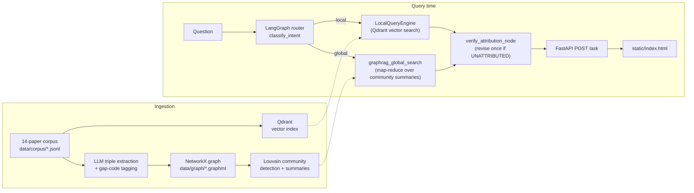
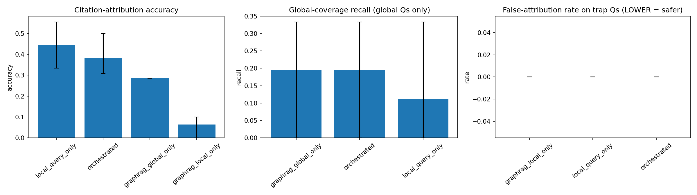

# Neurosurgery-AI GraphRAG Research Assistant

A GraphRAG-based research assistant over the neurosurgical-AI external-validation literature. It answers
**local** questions ("what did paper X find?") via vector retrieval, and **global** questions ("what gaps
recur across this literature?") via GraphRAG's community-summarization path — an automated version of the
by-hand literature-synthesis method behind this author's own 13-gap evidence dossier.

**Live demo:** _not yet deployed — fill in after the first Render/Fly deploy._ The free tier on either
platform sleeps after inactivity, so the first request after a quiet period may cold-start (tens of
seconds) — see [Deploy](#deploy) below before relying on it.

[](https://github.com/ahmedfawaz879/neurosurgery-graphrag-assistant/actions/workflows/ci.yml)
[](LICENSE)


## Architecture



See [`docs/ARCHITECTURE.md`](docs/ARCHITECTURE.md) for the full component breakdown, explicit design
decisions, rate-limiting, and deployment details.

## Quickstart (local)

```bash
git clone https://github.com/ahmedfawaz879/neurosurgery-graphrag-assistant.git
cd neurosurgery-graphrag-assistant
cp .env.example .env        # fill in OPENAI_API_KEY, or leave blank to run entirely on local fallback models
make install
make run-harness            # runs the QA set against all four system variants -> results/run.csv
make report                 # -> results/summary.csv + results/figures/gaprag_metrics_by_system.png
make serve                  # -> http://localhost:8000
```

Or run the whole stack (API + a real Qdrant container, instead of `:memory:` mode) via Docker:

```bash
cp .env.example .env
make docker-run             # docker compose up --build
```

## Deploy

`render.yaml` and `fly.toml` each deploy this repo as a single Docker service, defaulting to Qdrant
Cloud's free tier for the vector store (see `docs/ARCHITECTURE.md` for the self-hosted alternative).

> **Cost / rate-limit warning — read before deploying a public link.** This app makes a real, billed
> OpenAI API call on every `/ask` request, with no caching layer in this version. A portfolio visitor
> clicking around a public deployment generates real cost. Before sharing a live link: keep the built-in
> rate limiter in place (10 requests/minute/IP — demo-grade, not production-grade, see
> `docs/ARCHITECTURE.md`) and/or set an OpenAI usage cap / budget alert on the account. Do not deploy a
> version without a rate limit and call it "production-grade."

**Render:** connect this repo in the Render dashboard (Blueprint deploy from `render.yaml`), or:

```bash
# after creating the service once via the dashboard/Blueprint
make deploy-render
```

Set `OPENAI_API_KEY`, `QDRANT_URL`, and `QDRANT_API_KEY` as Render secrets (they're `sync: false` in
`render.yaml`, so Render will prompt for them rather than reading a committed value).

**Fly.io:**

```bash
fly launch --no-deploy   # first time only, uses fly.toml
fly secrets set OPENAI_API_KEY=sk-... QDRANT_URL=https://your-cluster.qdrant.io QDRANT_API_KEY=...
make deploy-fly
```

## Results



Real output from `make run-harness` + `make report` (`results/example_run.csv` /
`results/example_summary.csv` — not fabricated numbers):

| system | citation-attribution acc. | gap-resolution acc. | global-coverage recall | false-attribution rate |
|---|---:|---:|---:|---:|
| `local_query_only` | 0.444 | 0.750 | 0.111 | 0.000 |
| `graphrag_local_only` | 0.064 | 0.500 | — | 0.000 |
| `graphrag_global_only` | 0.286 | 1.000 | 0.194 | — |
| `orchestrated` | 0.381 | 0.800 | 0.194 | 0.000 |

`—` marks a metric that is not applicable for that system/question-type combination (e.g.
`global_coverage_recall` is only computed for `global` questions, and `graphrag_local_only`/
`graphrag_global_only` don't both apply to the same question type) — reported as missing, not as `0`,
per this repo's "ungradeable is not the same as wrong" convention (`src/eval/metrics.py`).

With N = 8 questions per system, these numbers are a demonstration of the pipeline and its evaluation
methodology, not a claim of statistical significance between systems — see bootstrap CI widths in
`results/example_summary.csv` and the Limitations below.

## Honesty / Limitations

> Reproduced verbatim from the source notebook's Sections 12–13
> (`notebooks/neurosurgery_graphrag_assistant.ipynb`) — this project's credibility argument rests on
> being as clear about its own limits as about what it claims to do.

### Discussion & Limitations

- **N = 14 papers, 8 questions.** Portfolio-scale demonstration of a method, not an adequately powered
  evaluation. Bootstrap CIs at this sample size are wide by construction — report them as such.
- **A 14-paper convenience sample selected to illustrate 13 named gap categories is not a systematic
  review**, and makes no claim to the coverage of the PRISMA/CHARMS-guided dossier this project echoes
  methodologically. One real paper per gap is enough to demonstrate the pipeline; it is not enough to
  support a claim like "this is what the field looks like."
- **Every abstract is an original paraphrase, not the source's own abstract or a lightly reworded copy**
  — written this way deliberately so nothing here substitutes for reading the paper, but a paraphrase is
  still a lossy compression of the source; verify any claim you plan to rely on against the cited URL.
- **Gap-tag classification is itself an LLM call** (`classify_answer_gaps`), and inherits whatever biases
  or failure modes that model has — a stronger design would validate a sample of its outputs against
  human gap-tagging before trusting `gap_resolution_accuracy` numbers at face value. This risk compounds
  with real literature: an LLM misclassifying a real paper's gap category is a more consequential error
  than misclassifying a synthetic one, because a user might act on it.
- **Local search's two implementations (Section 4's embedding-based `local_query` vs. Section 7's
  keyword-overlap `graphrag_local_search`) are not expected to perform equally** — the keyword-overlap
  version is a deliberately simple baseline for the graph-traversal path, not a tuned competitor to the
  vector-index path.
- **Neo4j export is generated, not exercised.** `to_neo4j_cypher()`'s output has not been run against a
  live Neo4j instance in this notebook; treat it as an untested code path until it has been.
- **One paper's finding (paper_08) is an active, contested scientific dispute as of this notebook's
  authoring, not a settled result.** The system's answers about it reflect the state of that dispute at
  authoring time and may already be outdated — check the citation trail, not just the assistant's summary.
- **No real external validation of the pipeline itself.** Everything here is evaluated on the same corpus
  it was built against.

### What this notebook is NOT

- **Not a systematic review**, and not a substitute for the PRISMA/CHARMS-guided dossier it operationalizes
  the synthesis method of. A 14-paper, one-per-gap corpus demonstrates the pipeline; it does not survey the
  field.
- **Not a claim of exhaustive or representative literature coverage** on any of the 13 gap topics — each
  paper was selected as one clear, verifiable illustration of its gap category, not as the definitive or
  most-cited work on that topic.
- **Not clinical or research guidance** — outputs should not be used to make decisions about which model to
  validate, cite, or trust without independently checking the primary literature at the linked URL.
- **Not a substitute for reading the cited papers.** Every abstract in this notebook is a paraphrase, and
  every graph-derived claim is an LLM's inference over that paraphrase — two steps removed from the primary
  source. Treat this assistant's output as a pointer to where to look, not as the final word on what a paper
  found.
- **Not a reproduction of Microsoft's `graphrag` package** or of any named production system.

## Repo structure

```
neurosurgery-graphrag-assistant/
├── src/
│   ├── config.py            # Config dataclass, loaded from env vars
│   ├── llm/                 # OpenAIBackend (quota -> local Qwen fallback)
│   ├── data/                # Pydantic schemas + corpus/QA/taxonomy loaders
│   ├── ingestion/            # Qdrant index build (embeddings quota fallback)
│   ├── retrieval/            # LocalQueryEngine, Qdrant/Pinecone backends
│   ├── graphrag/              # triple extraction, graph build, communities,
│   │                          #   local/global search, Neo4j export
│   ├── orchestration/          # LangGraph intent-routing + attribution graph
│   ├── eval/                   # metrics, bootstrap CIs, harness runner
│   ├── reporting/               # aggregation + bar-with-CI plots
│   └── api/                     # FastAPI service (POST /ask, /health, /)
├── data/                          # gap taxonomy, literature corpus, QA set
├── notebooks/                      # the canonical narrative notebook
├── results/                         # example_run.csv / example_summary.csv (real)
├── static/index.html                 # single-file, dependency-free chat UI
├── scripts/generate_report.py
├── tests/
├── docs/ARCHITECTURE.md
├── Dockerfile, docker-compose.yml
├── pyproject.toml, Makefile
├── render.yaml, fly.toml
├── .env.example, .gitignore
├── .github/workflows/ci.yml
└── LICENSE (MIT)
```

## Related work

- **Companion project:** [Clinical RAG/GraphRAG Evaluation Harness](https://github.com/ahmedfawaz879/clinical-rag-eval-harness)
  — this project reuses that harness's validation instincts (bootstrap CIs, harm-encoding-style metrics,
  explicit ablation) applied to a literature-synthesis assistant instead of a clinical-note QA system.
- **Domain framing:** this project's 13-gap taxonomy and neurosurgical-AI domain framing draw on this
  author's own external-validation evidence dossier for neurosurgical AI — see the notebook's introduction
  for the underlying gap categories this corpus was selected to illustrate.

## License

[MIT](LICENSE) © 2026 Ahmed Fawaz
